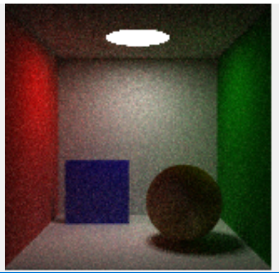
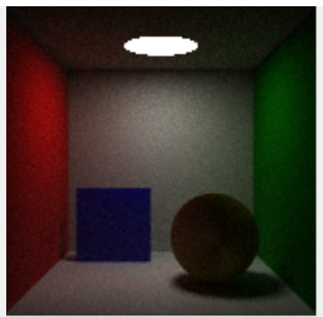
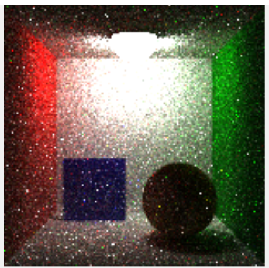
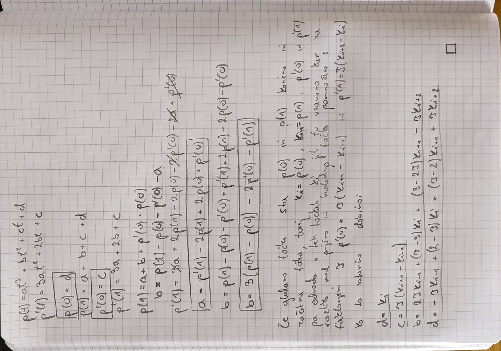

# NRG
Repository for all homework assignments for class NRG

# Homework 1
Point interpolation using Shepard's methods and Octree. You will find two example files in the HW1/data folder whoose values have been converted to uint8's, one for basic and one for modified method.

## How to run
1. Checkout repository with ``git clone git@github.com:vkriznar/NRG.git``
2. Enter directory with code ``cd HW1/src/main/java``
3. Compile java code ``javac Main.java``
4. Run for basic method ``java Main < ../../../data/input1k.txt > ../../../data/output.raw --method basic --p 0.5 --min-x -1.5 --min-y -1.5 --min-z -1 --max-x 1.5 --max-y 1.5 --max-z 1 --res-x 128 --res-y 128 --res-z 64``
5. Run for modified method ``java Main < ../../../data/input1k.txt > ../../../data/output.raw --method modified --r 0.5 --min-x -1.5 --min-y -1.5 --min-z -1 --max-x 1.5 --max-y 1.5 --max-z 1 --res-x 128 --res-y 128 --res-z 64``

# Homework 2
Ray tracing algorithm implemented with PathTracerFramework in C#. Changes are made in following files inside ``HW2/PathTracerFramework``
- ``PathTracer.cs``
- ``Helpers/Samplers.cs``
- ``MaterialsLight/OrenNayar.cs``
- ``Primitives/Sphere.cs``

Following images are example renders.
1. Lambertian material with disk light

2. Oren-Nayar material with disk light. We can see that the edges are more nicely defined.

3. Oren-Nayar material with sphere light. Although it looks a bit more ricey, we can see the walls are much more lighted.

# Homework 3
Animation script implemented in python that as input recieves a set of polygonal objects stored in OBJ waveform file, and the timestamps at which these models have to be shown. Interpolation was done using Catmull-Rom splines. Framerate can be modyfied by user.

Following are four different animations (Click on picture to play the animation).

And lastly the derivation of the Catmull-Rom splines equation.

